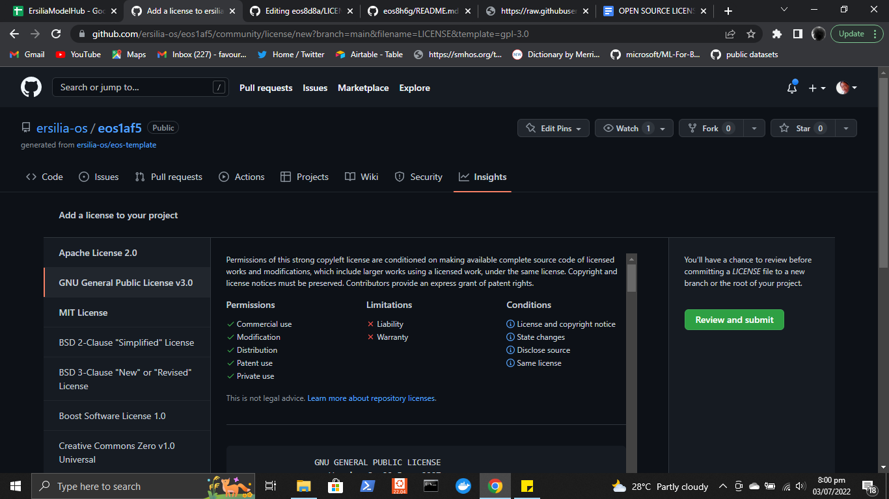
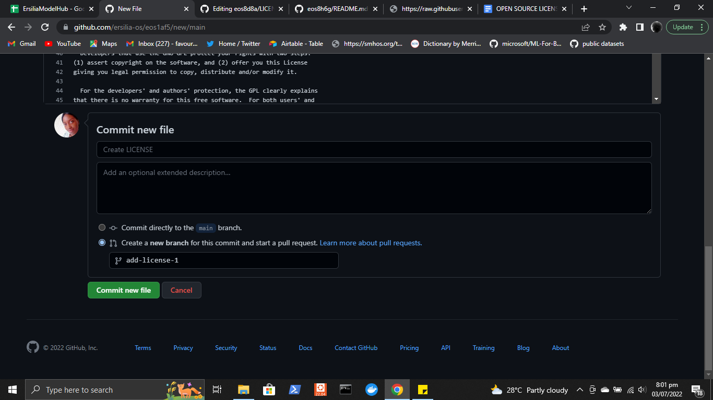
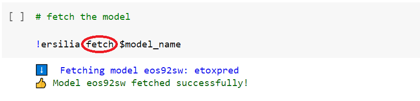
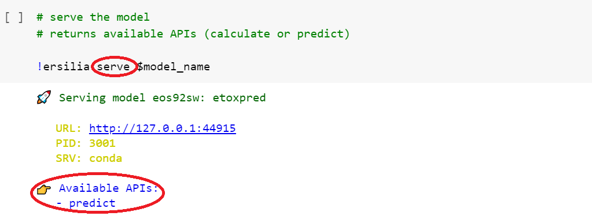
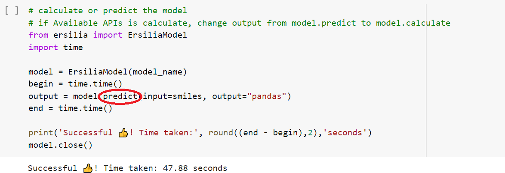
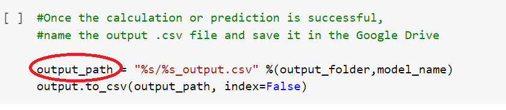

# Ersilia on Google Colab

## **Table of content:**

1. What is Google Colab?
2. Getting Started on using Google Colab
3. Ersilia installation on Google Colab
4. How to import data on Google Colab?
5. What are SMILES strings?
6. Working with Files
7. Fetch, Serve and Predict Ersilia models
8. How to save your output
9. Conclusion

### **What is Google Colab?** 

Google Colab allows you to write and execute python code through the browser, it is a well-suited coding environment for machine learning and data analysis having more computing resources (CPU, GPU, and TPU). This allows it to be a favorite tool in the field of machine learning and artificial intelligence research.

It is also free to use and anyone can have access to it.

If you prefer to read more on Google Colab, you can check out Google [Colab Documentation and Code Snippet](https://colab.research.google.com/notebooks/welcome.ipynb), you can also interact with the community on [Stack Overflow](https://stackoverflow.com/questions/tagged/google-colaboratory).

### **Getting Started on using Google Colab** 

You don’t need to install any prerequisite, all you need is a working laptop with a stable connection, and you also need to have a Gmail account.

You’ll have access to a Jupyter Notebook-like environment.

### **3. Ersilia installation on Google Colab**

Click the play button on the below image to install the Ersilia Model Hub on Google collab. It will upload a folder named Sample\_folder onto your notebook, and here you can find the various packages installed on the Notebook.

<figure><figcaption></figcaption></figure>

### **How to import data on Google Colab?**

There are several ways to import data on Google Colab.

We will talk about how to import data from your google drive here, but you can learn about the various other methods[ here](https://colab.research.google.com/notebooks/io.ipynb).

To mount your drive Run the following code.

<figure><figcaption></figcaption></figure>

A pop-up will come up requesting access to connect to your google drive.

<figure><figcaption></figcaption></figure>

After clicking “Connect to Google Drive” it will take you to a follow-up google page to sign in to your email account to allow Google Colab to access your google drive.

To locate the folder in Drive where the Google Colab files are located. You can find it in the File tab located at the top left of your Google Colab environment: “File -> Located in Drive”. When we click on ‘Locate in drive’, this takes us to the folder where all the files are located called: "Colab Notebook".

When you are inside the Colab Notebooks folder on the drive you can upload the file:

<figure><figcaption></figcaption></figure>

From the side panel, you can explore the files that were mounted as shown in the figure below:

<figure><figcaption></figcaption></figure>

<figure><figcaption></figcaption></figure>

Now, we define all paths in the starting e.g. from where to get the input file and save the output files, etc.

<figure><figcaption></figcaption></figure>

### **5. What are SMILES strings?**

The computer software can only understand molecules if it is represented in numeric vectors or images, SMILES is used to translate a chemical structure into a string using ASCII characters.

Take for example a molecule like an n-pentane _**CH3CH2CH2CH2CH3**_ with only single bonds that can be represented as **CCCCC.**

We will be working with SMILES string, which are passed as an input to run predictions/calculations on a molecules using Ersilia model hub. For more deeper details, see [here](https://ersilia.gitbook.io/ersilia-book/ersilia-model-hub/inputs)

### **Working with Files**

You can follow the steps listed below to convert your input file into SMILE strings.

The input path is defined globally at the start. So, it automatically passes here. You just have to run the code cell to proceed.

<figure><figcaption></figcaption></figure>

### **7. Fetch, Serve and Predict models**

Google Colab runs in a Linux environment on the cloud, we start the beginning of a line with '<mark style="color:blue;">**!**</mark>**'**. To specify that this is a Linux command and not a python statement.

We define the model as a global parameter, i.e. model\_name, so we don’t have to manually change it throughout the notebook whenever we want to run a notebook for a different model.

The identifier is the “eos-id” like “eos92sw” while the slug is the word reference for the model i.e. retrosynthetic-accessibility.

You can define model\_name either using an identifier e.g. “eos92sw” as shown in the figure below,

Or define it using slug e.g. “retrosynthetic-accessibility” as shown in the figure below,

To **fetch** the ersilia model, we use fetch API.

After fetching the model successfully, it’s time to **serve** the model so one should get to know which is the correct API either to make predictions or calculate molecular weight using the specified model.

After serving the model, it’s time to use the correct API that we get from the serve API to generate the output accordingly. For example, for model “eos92sw” the available API is “Predict”. So, we use **predict** API to generate output.

### Saving your output

After running the predict or calculate API on your input, it’s time to store the output in .csv format. The output .csv file saves in the defined output folder.

Just like the input file is uploaded and a path is copied, a new file needs to be created to store the output. The side panel where the Drive files are located is where the file is created.

1. Open the files.
2. Right-click to add a new file and rename (output.csv as indicated in the image below)
3. Click on the three-dotted mark beside your output file and select copy path
4. Paste the path copied into the specified output\_ path(Circled in red in the above image).
5. Then you can proceed to run the code cell.

<figure><figcaption></figcaption></figure>

### **Conclusion**

In this guide, we learned the basics of Google Colab, a widely used and handy tool for data scientists, researchers, and students. Also, the guide takes a step-by-step guide on how to navigate the Ersilia Model Hub to test our input file and get results.
