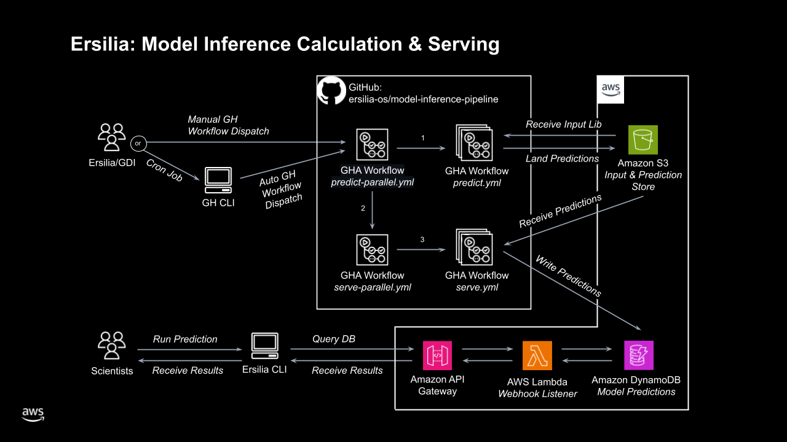

# Ersilia Cache Retrieval Guide

This caching layer sits in front of Ersilia’s batch inference pipeline, giving you fast, fault-tolerant access to previously computed predictions. Under the hood it reuses the same AWS infrastructure—GitHub Actions workers for compute, S3 for bulk storage, DynamoDB as the cache database, and a serverless API served by Lambda + API Gateway—all managed via AWS CDK and deployed via GitHub Actions.\
\
Key AWS components used for cloud caching:

* **Compute & orchestration**: GitHub Actions workers running inference in parallel
* **Bulk storage**: S3 bucket holding CSVs of pre-calculations
* **Cache database**: DynamoDB tables for fast lookup
* **Serverless API**: Lambda + API Gateway endpoints to fetch cached results
* **Infrastructure as code**: AWS CDK definitions under `infra/precalculator` ([GitHub - ersilia-os/model-inference-pipeline: Ersilia's batch inference pipeline on the AWS cloud](https://github.com/ersilia-os/model-inference-pipeline))

***

<figure><figcaption></figcaption></figure>

### CLI Flags & Behavior

All commands begin with `ersilia` and take a model ID or bucket name (e.g. `eos3b5e`). The three mutually‐exclusive flags determine where to fetch cached results from:

| Flag                    | Dump Behavior                                                                                                                                                                                                                                                                      | Run Behavior                                                                                                                      |
| ----------------------- | ---------------------------------------------------------------------------------------------------------------------------------------------------------------------------------------------------------------------------------------------------------------------------------- | --------------------------------------------------------------------------------------------------------------------------------- |
| `--cloud-cache-only`    | <p>- <strong>All entries</strong>: export every pre-calculation stored in S3.<br>- <strong>Sampled subset</strong> (<code>-n SIZE</code>): get a random selection of up to SIZE entries (or all if fewer).</p>                                                                     | For each SMILES, fetch from the cloud cache. Missing values are marked as .                                                       |
| `--local-cache-only`    | <p>- <strong>All entries</strong>: export every entry in local Redis.<br>- <strong>Sampled subset</strong> (<code>-n SIZE</code>): get a random selection of up to SIZE entries (or all if fewer).</p>                                                                             | For each SMILES, fetch from Redis. Missing values are marked as `None`.                                                           |
| `--cache-only` (hybrid) | <p>- <strong>Full export</strong>: dump all Redis entries, then all S3 entries, merged into one CSV.<br>- <strong>Sampled export</strong> (<code>-n SIZE</code>):<br>1. Take up to SIZE from Redis.<br>2. If Redis has fewer, fill the remainder with a random sample from S3.</p> | <p>For each SMILES:<br>1. Try Redis lookup.<br>2. If not found, fetch from cloud.<br>3. If still missing, compute on the fly.</p> |

#### Detailed Flag Behavior (User-Friendly)

**`--cloud-cache-only`**

* **Dump**
  * _**All entries**_: Exports every pre-calculated result stored in S3.
  * _**Sampled subset**_: When you specify `-n SIZE`, you receive a random selection of up to SIZE entries. If fewer than SIZE entries exist in S3, you simply get everything that’s available.
* **Run**
  * For each SMILES in your input file, the system looks up the value in the cloud cache.
  * Any SMILES without a cached result are marked as  in the output, indicating “no value.”

**`--local-cache-only`**

* **Dump**
  * _**All entries**_: Exports every entry currently in your local Redis cache.
  * _**Sampled subset**_: When given `-n SIZE`, you receive a random selection of up to SIZE entries. If Redis holds fewer than SIZE entries, you’ll get them all.
* **Run**
  * Each input SMILES is checked against Redis.
  * Missing values are written as `None` in the output file.

**`--cache-only`**

* **Dump**
  * _**Full export**_: Retrieves every entry from Redis first, then pulls all remaining entries from S3—combining both into one CSV.
  * _**Limited export**_:
    1. Gather all Redis entries.
    2. If that collection already meets or exceeds your requested size (via `-n`), you receive the first items up to SIZE.
    3. Otherwise, you get all Redis entries plus a random selection from S3 to reach SIZE total.
* **Run**
  1. Each SMILES is first looked up in Redis.
  2. If it’s not found locally, the system fetches it from S3.
  3. Any entries still missing after both checks left empty.

***

### Example Command usage

1.  **Local cache only**

    ```bash
    ersilia serve eos3b5e --local-cache-only
    ersilia run  -i example.csv -o output.csv   # Assume 80 inputs → only those in Redis; others “None”
    ersilia dump -n 1000 -o dumped_output.csv  # up to 1000 from Redis; if only 100 exist, dumps 100
    ```
2.  **Cloud cache only**

    ```bash
    ersilia serve eos3b5e --cloud-cache-only
    ersilia run  -i example.csv -o output.csv   # 80 inputs → those in S3 (missing → “\N”)
    ersilia dump -n 1000 -o dumped_output.csv  # up to 1000 from S3; if only 200 exist, dumps 200
    ```
3.  **Hybrid cache**

    ```bash
    ersilia serve eos3b5e --cache-only
    ersilia run  -i example.csv -o output.csv   # 80 inputs → first from Redis, then S3, then calculate
    ersilia dump -n 1000 -o dumped_output.csv  # combines Redis + S3 up to 1000 entries
    ```
