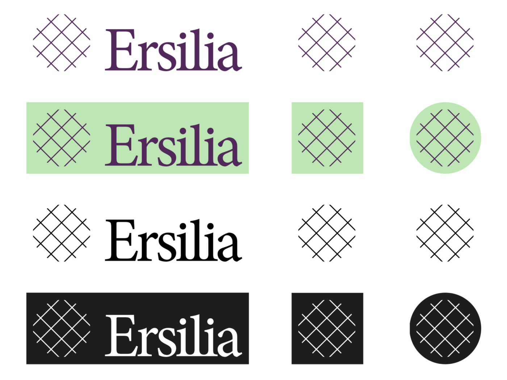
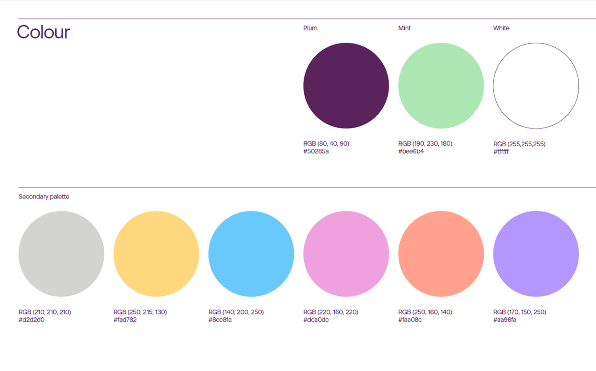

# Brand guidelines

Ersilia's brand guidelines were developed by [Forma.co](https://forma.co). You can find an explanation in [this blog post](https://medium.com/ersiliaio/ersilia-open-source-initiative-brand-guidelines-130fe53104f5).

## Logo

<figure><figcaption>
Logo and symbol allowed combinations
</figcaption></figure>


Official logo in vectorial format


More versions of the logo can be found in [this folder](https://drive.google.com/drive/folders/19SM1ALd4wYbmcEqPEqZV-q6FTQ\_82I3c?usp=sharing).

## Colors

<figure><figcaption>
Ersilia color palette
</figcaption></figure>

| Color name | HEX     | RGB           |
| ---------- | ------- | ------------- |
| Plum       | #BEE6B4 | (80,40,90)    |
| Mint       | #50285A | (190,230,180) |
| White      | #FFFFFF | (255,255,255) |
| Gray       | #D2D2D0 | (210,210,210) |
| Yellow     | #FAD782 | (250,215,130) |
| Blue       | #8CC8FA | (140,200,250) |
| Pink       | #DCA0DC | (220,160,220) |
| Orange     | #FAA08C | (250,160,140) |
| Purple     | #AA96FA | (170,150,250) |

## Typography

Ersilia's corporate typeface is **Beausite Classic Clear**, with the addition of **Beausite Classic Clear Italic** and **Beausite Classic Semi Bold**.

<figure><figcaption>
Ersilia's corporate typography.
</figcaption></figure>
